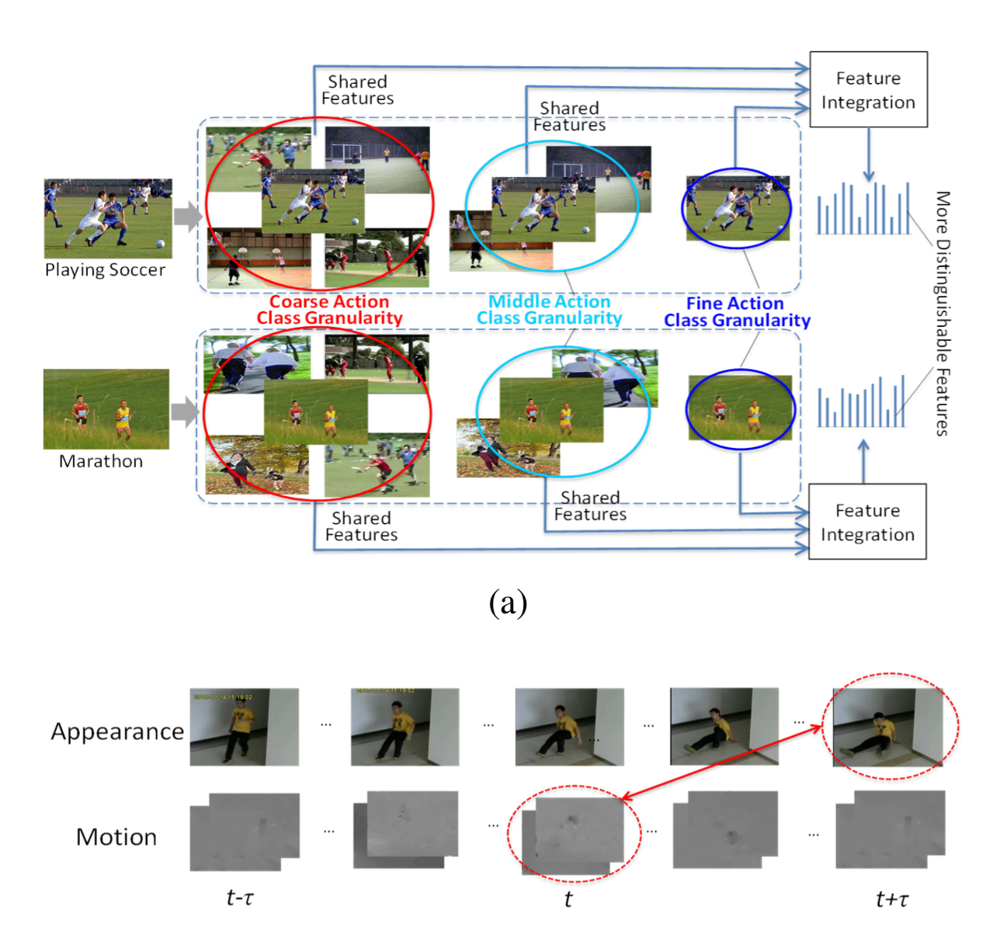
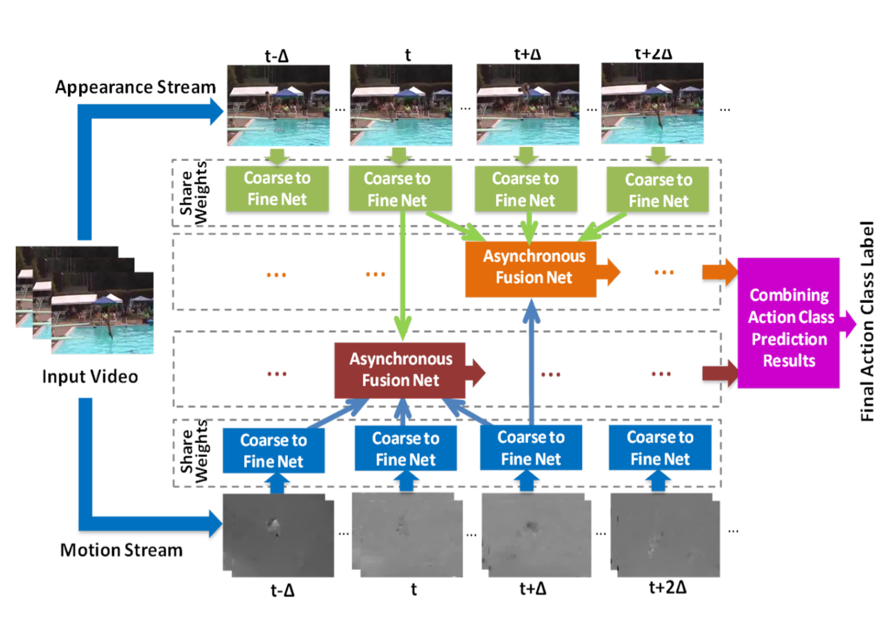
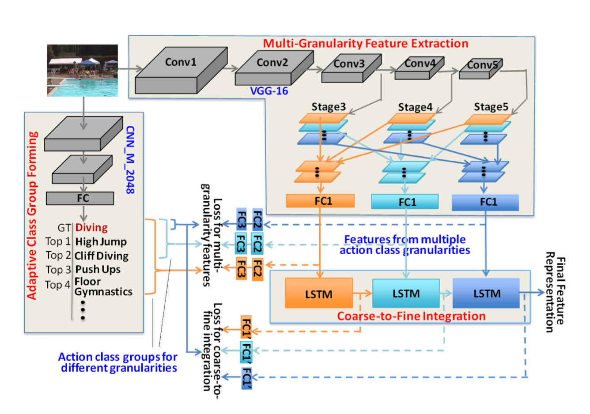
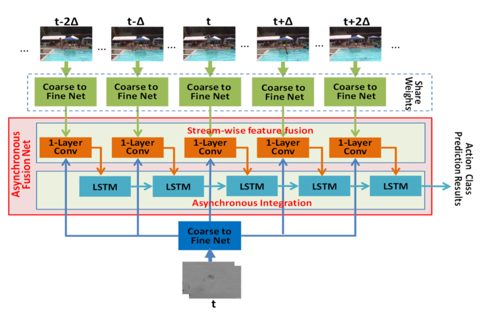

### Action Recognition with Coarse-to-Fine Deep Feature Integration and Asynchronous Fusion

这篇文章提出了coarse to fine网络用来提取特征，以及asynchronous fusion网络来融合特征流。

a图表示了coarse to fine的流程，每个动作动作先是分类到一个大的set中，之后再分类到中等set中，最后再进行精确分类。这样就能一层一层地提取一个动作集的共享的特征。这些动作集是自动地动态划分的。b图表示了异步融合网络，将不同时间步的appearance与motion特征进行融合。

下图是总体的流程。

#### Coarse to fine network

该网络有三个模块组成

1. Multi-granularity feature extraction

   用于为不同粒度的动作类别提取特征。将多个stage的特征如图所示上采样后拼接到一起，每一个group表示不同的粒度

2. adaptive class group forming

   只在训练阶段用到，参数冻结。这个阶段用来为形成合适的动作集来指导特征提取。用一个预训练的CNN来对input进行分类，分别取top5，top3，top1来组成三个粒度的动作集。如果预测的label不在groundtruth list里面，就加进去。最后用交叉熵损失函数，使特征提取模块能根据动作集来提取对应动作集的共享的特征。

   

   W是Multi-granularity feature extraction的参数，N是动作类别的总个数，$G_k$是对第k个动作类别粒度的动作集，$\alpha$是对应的动作类别粒度的重要性

3. coarse-to-fine integration

   这个模块使用LSTM，输入多个粒度的特征，输出精确结果。

   

总体的损失函数如下

#### Asynchronous Fusion Network

目的是对input stream在时间t的特征和其他stream时间t周围的特征进行融合。输入是多个stream的某一时间步的特征，用一个单层卷积神经网络和1x1的核进行融合。

思考：

用卷积网络学习不同粒度的特征是个很好的想法，比较简单的方法就是直接用一个CNN的不能层的feature map作为multi-scale feature。很多时空特征融合都是对相同时间t进行加法/乘法/串接，这里的异步融合网络考虑了异步问题很有用，而且融合方法也有创新。
